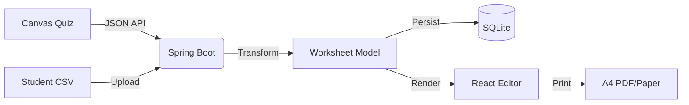

# JSON-Printer: Educational Worksheet Utility

A local-first, stateless tool to convert Canvas quizzes and student data into print-optimized worksheets.

## 🚀 The 'Big Picture'
JSON-Printer acts as a hybrid bridge between online Learning Management Systems (Canvas) and the physical classroom. It fetches digital quiz data, allows teachers to interactively format it into multi-page A4 worksheets, and provides high-fidelity browser-based printing.

## 🛠 Tech Stack
- **Backend**: Spring Boot 3.5 (Java 21), Spring Data JPA.
- **Frontend**: React 19, TypeScript, Vite, Tailwind CSS.
- **Database**: SQLite (Local file-based).
- **Build System**: Maven (integrated frontend build via `frontend-maven-plugin`).
- **Platform**: Windows only (Chrome/Edge recommended).

## 🏗 Architecture
The system follows a **Layered Monolith** pattern:
1. **API Layer**: Spring Boot REST controllers.
2. **Service Layer**: Handles QTI parsing, CSV processing, and worksheet generation.
3. **Presentation Layer**: Interactive React SPA with a custom worksheet state engine.
4. **Persistence Layer**: Local SQLite for worksheets and caching.

## 🚦 Getting Started
1. **Clone & Build**:
   ```bash
   mvn clean install
   ```
2. **Run Application**:
   ```bash
   mvn spring-boot:run
   ```
3. **Access**:
   Open `http://localhost:8080` in your Chrome/Edge browser.

## 📦 Data Flow Diagram

