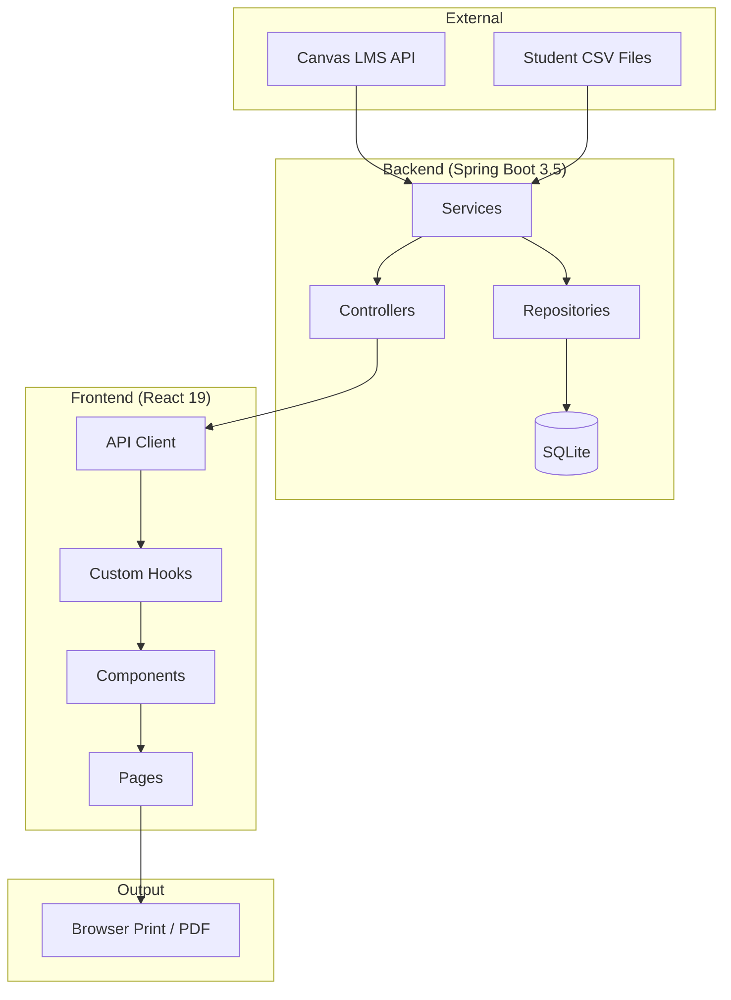
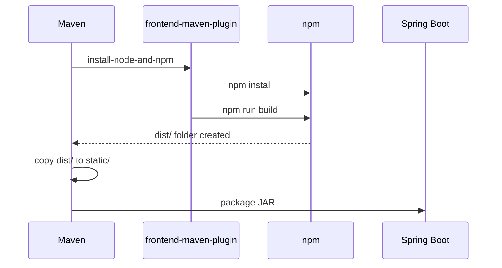

# JSON-Printer Architecture & Feature Guide

> **Local-First Educational Worksheet Utility**  
> A hybrid Java + React application for converting Canvas LMS quizzes into print-optimized worksheets.

---

## Table of Contents

1. [System Overview](#system-overview)
2. [Technology Stack](#technology-stack)
3. [Architecture Diagram](#architecture-diagram)
4. [Project Structure](#project-structure)
5. [Backend Architecture](#backend-architecture)
6. [Frontend Architecture](#frontend-architecture)
7. [Data Models](#data-models)
8. [Feature Breakdown](#feature-breakdown)
9. [Build & Development](#build--development)
10. [Design Principles](#design-principles)

---

## System Overview

JSON-Printer acts as a **bridge between online Learning Management Systems (Canvas LMS)** and **the physical classroom**. Teachers can:

1. **Fetch** quiz data from Canvas API
2. **Transform** data into structured worksheet formats
3. **Customize** content in a WYSIWYG worksheet builder
4. **Print** A4-optimized pages for classroom use

### Mental Model

```text
┌─────────────────┐     ┌─────────────────┐     ┌─────────────────┐
│  Canvas LMS     │────▶│  Spring Boot    │────▶│  React SPA      │
│  (Quiz JSON)    │     │  (Orchestrator) │     │  (Builder UI)   │
└─────────────────┘     └────────┬────────┘     └────────┬────────┘
                                 │                       │
                        ┌────────▼────────┐     ┌────────▼────────┐
                        │  SQLite (Local) │     │  Browser Print  │
                        │  (Persistence)  │     │  (A4 Output)    │
                        └─────────────────┘     └─────────────────┘
```

---

## Technology Stack

| Layer        | Technology                                      |
| ------------ | ----------------------------------------------- |
| **Backend**  | Spring Boot 3.5, Java 21                        |
| **Frontend** | React 19, TypeScript, Vite, Tailwind CSS        |
| **Database** | SQLite (file-based, local)                      |
| **Build**    | Maven (frontend-maven-plugin integrates npm)    |
| **Japanese** | Lucene Kuromoji (tokenizer for vocabulary)      |
| **CSV**      | Apache Commons CSV (student data parsing)       |

### Key Dependencies

**Backend (`pom.xml`)**
- `spring-boot-starter-web` - REST API
- `spring-boot-starter-data-jpa` - ORM with Hibernate
- `sqlite-jdbc` + `hibernate-community-dialects` - SQLite support
- `lucene-analysis-kuromoji` - Japanese vocabulary analysis
- `commons-csv` - CSV parsing for student data

**Frontend (`package.json`)**
- `react`, `react-dom` - Core UI
- `tailwindcss` - Utility-first styling
- `vite` - Fast HMR build
- `typescript` - Type safety

---

## Architecture Diagram



---

## Project Structure

```text
json-printer/
├── pom.xml                         # Maven configuration (builds both backend + frontend)
├── GEMINI.md                       # AI agent configuration
├── 1.1.1.1_RULES.md               # Coding style guide (1 Component, 1 Style, 1 Design, 1 Architecture)
│
├── src/main/java/com/qtihelper/demo/
│   ├── DemoApplication.java        # Spring Boot entry point
│   ├── config/                     # Configuration classes
│   ├── controller/                 # REST & MVC controllers (7 files)
│   │   ├── AnalyticsController     # Student performance analytics API
│   │   ├── DashboardController     # Canvas course/quiz listing
│   │   ├── DevLogController        # Development logging API
│   │   ├── PrintReportController   # Print report generation endpoints
│   │   ├── QuizImportController    # Quiz JSON parsing & QTI conversion
│   │   ├── SpaController           # React SPA forwarding
│   │   └── WorksheetStorageController # Worksheet CRUD operations
│   ├── dto/                        # Data Transfer Objects (25 files)
│   ├── entity/                     # JPA Entities (5 files)
│   │   ├── DevLog                  # Development log entries
│   │   ├── SavedQuiz               # Cached quiz data
│   │   ├── Vocab                   # Vocabulary items
│   │   ├── Worksheet               # Saved worksheet templates
│   │   └── WorksheetType           # Enum: SNAPSHOT | TEMPLATE
│   ├── model/                      # Domain models (10 files)
│   ├── repository/                 # Spring Data JPA repositories (4 files)
│   ├── service/                    # Business logic services (18 files)
│   │   ├── Canvas*                 # Canvas API integration
│   │   ├── Csv*                    # CSV parsing services
│   │   ├── Qti*                    # QTI package generation
│   │   ├── Print*                  # Print report generation
│   │   ├── Statistics*             # Analytics calculation
│   │   └── Worksheet*              # Worksheet generation & analysis
│   └── util/                       # Utility classes (3 files)
│
├── worksheet-ui/                   # React Frontend (embedded via Maven)
│   ├── src/
│   │   ├── App.tsx                 # Main router component
│   │   ├── api/                    # HTTP client modules
│   │   │   ├── client.ts           # Base fetch wrapper
│   │   │   ├── courses.ts          # Canvas course API
│   │   │   ├── printReport.ts      # Print report API
│   │   │   ├── qtiConverter.ts     # QTI conversion API
│   │   │   └── worksheets.ts       # Worksheet CRUD API
│   │   ├── components/             # Reusable UI components (39 files)
│   │   │   ├── GridItem.tsx        # Japanese character grid
│   │   │   ├── VocabItem.tsx       # Vocabulary list item
│   │   │   ├── MenuBar.tsx         # Context menu for editing
│   │   │   ├── Sidebar.tsx         # Layer/property panel
│   │   │   ├── editors/            # Property editors (8 files)
│   │   │   ├── items/              # Worksheet item renderers (8 files)
│   │   │   └── ui/                 # Shared primitives (4 files)
│   │   ├── hooks/                  # Custom React hooks (6 files)
│   │   │   ├── useAutoSave.ts      # Debounced auto-save
│   │   │   ├── useGridSections.ts  # Grid character management
│   │   │   ├── useSettings.ts      # App settings from localStorage
│   │   │   ├── useTheme.ts         # Theme switching
│   │   │   └── useWorksheet.ts     # Worksheet state management
│   │   ├── pages/                  # Page components (12 files)
│   │   ├── types/                  # TypeScript definitions (7 files)
│   │   └── utils/                  # Utility functions (12 files)
│   └── dist/                       # Built output (copied to static/)
│
└── docs/                           # Documentation (13 files)
    ├── GRID_BOX_SPECIFICATION.md   # Character grid feature spec
    ├── FEATURE_ROADMAP.md          # Planned features
    └── ...
```

---

## Backend Architecture

### Controllers (7)

| Controller                   | Endpoints           | Purpose                                    |
| ---------------------------- | ------------------- | ------------------------------------------ |
| `AnalyticsController`        | `/api/analytics/*`  | Student performance data and statistics    |
| `DashboardController`        | `/api/courses/*`    | Canvas course/quiz listing                 |
| `DevLogController`           | `/api/devlog/*`     | Development logging (AI_TRACE support)     |
| `PrintReportController`      | `/api/print/*`      | Print report generation endpoints          |
| `QuizImportController`       | `/api/quiz/*`       | Quiz parsing, validation, QTI export       |
| `SpaController`              | `/**`               | Forwards unknown routes to React SPA       |
| `WorksheetStorageController` | `/api/worksheets/*` | Worksheet CRUD operations                  |

### Services (18)

### Canvas Integration
- `CanvasCacheService` - Caches Canvas API responses
- `CanvasMigrationService` - Handles Canvas data migration
- `CanvasQuizFetcher` - Fetches quizzes from Canvas API

### Data Processing
- `CsvSubmissionParser` - Parses student submission CSV files
- `StudentSubmissionParser` - Processes student answer data
- `JsonQuizParserService` - Parses Canvas quiz JSON

### QTI Generation
- `QtiContentGeneratorService` - Generates QTI question content
- `QtiMetaGeneratorService` - Generates QTI metadata files
- `ManifestGeneratorService` - Creates IMS manifest
- `ZipArchiveService` - Packages QTI into ZIP

### Worksheet & Print
- `WorksheetGeneratorService` - Creates worksheet templates
- `WorksheetAnalysisService` - Analyzes worksheet content
- `PrintReportGenerator` - Generates printable reports
- `QuizPrintViewModelMapper` - Maps quiz data to print models

### Statistics & Vocabulary
- `StatisticsService` - Calculates student performance stats
- `SudachiTokenizerService` - Japanese text tokenization
- `VocabSeederService` - Seeds vocabulary data

### Entities (5)

```java
// Worksheet entity with JSON content storage
@Entity
public class Worksheet {
    Long id;
    String name;
    String jsonContent;      // Full worksheet JSON
    LocalDateTime createdAt;
    LocalDateTime updatedAt;
    WorksheetType type;      // SNAPSHOT or TEMPLATE
    Long parentId;           // For versioning
    String metadata;         // JSON string
}

// Saved quiz cache
@Entity
public class SavedQuiz {
    Long id;
    String quizId;
    String courseId;
    String jsonData;
}

// Vocabulary entry
@Entity
public class Vocab {
    Long id;
    String term;
    String reading;
    String meaning;
}

// Development log (AI_TRACE)
@Entity
public class DevLog {
    Long id;
    String message;
    String level;
    LocalDateTime timestamp;
}
```

---

## Frontend Architecture

### Pages (12)

| Page                      | Route                    | Purpose                                  |
| ------------------------- | ------------------------ | ---------------------------------------- |
| `LandingPage`             | `#/`                     | Home with navigation sidebar             |
| `DashboardPage`           | `#/courses`              | Canvas course & quiz listing             |
| `WorksheetDashboardPage`  | `#/worksheets`           | Saved worksheets management              |
| `WorksheetPage`           | `#/worksheet/:id`        | WYSIWYG worksheet builder                |
| `QtiImportPage`           | `#/quiz/import`          | Quiz JSON upload/paste                   |
| `QtiEditorPage`           | `#/quiz/editor`          | Edit parsed quiz data                    |
| `QtiSuccessPage`          | `#/quiz/success`         | Download QTI package                     |
| `PrintReportViewPage`     | `#/print-report/view`    | Individual student reports               |
| `PrintReportSlipPage`     | `#/print-report/slip`    | Class-wide answer slips                  |
| `PrintReportBlankPage`    | `#/print-report/blank`   | Blank quiz forms                         |
| `AnalyticsPage`           | `#/analytics`            | Student performance analytics            |
| `SettingsPage`            | `#/settings`             | App configuration                        |

### Key Hooks (6)

```typescript
// Worksheet state management - central state engine
const useWorksheet = () => {
  // Pages: WorksheetPage[] - multi-page support
  // selectedItem, mode (student/teacher), metadata
  // CRUD operations for items
};

// Grid character input handling
const useGridSections = () => {
  // Character box management
  // Section breaks, furigana support
  // Japanese IME handling
};

// Auto-save with debouncing
const useAutoSave = () => {
  // localStorage + optional backend sync
  // Dirty state tracking
};

// App settings from localStorage
const useSettings = () => {
  // Theme, Canvas API config, preferences
};
```

---

## Data Models

### Worksheet Item Types (8)

All worksheet items implement a common pattern:

```typescript
interface BaseItem {
  id: string;
  type: 'HEADER' | 'CARD' | 'GRID' | 'VOCAB' | 
        'MULTIPLE_CHOICE' | 'TRUE_FALSE' | 'MATCHING' | 'CLOZE';
  showPromptNumber?: boolean;
  promptNumber?: number;
  customLabel?: string;
}
```

| Type              | Purpose                                      | Key Properties                         |
| ----------------- | -------------------------------------------- | -------------------------------------- |
| `HEADER`          | Title/section header                         | `title`, `showName`, `showDate`        |
| `CARD`            | Free-form text block                         | `content`, `cardStyle`, `columns`      |
| `GRID`            | Japanese character writing grid              | `boxSize`, `sections[]`, `furigana`    |
| `VOCAB`           | Vocabulary list with terms/meanings          | `terms[]`, `columns`, `listStyle`      |
| `MULTIPLE_CHOICE` | Multiple choice question                     | `options[]`, `correctIndex`            |
| `TRUE_FALSE`      | True/false with optional reasoning           | `questions[]`, `showDashedLines`       |
| `MATCHING`        | Match left-right pairs                       | `pairs[]`, `layout`                    |
| `CLOZE`           | Fill-in-the-blank                            | `template`, `answers[]`, `blankWidth`  |

### Worksheet State

```typescript
interface WorksheetState {
  pages: WorksheetPage[];       // Multi-page support
  currentPageIndex: number;
  selectedItem: WorksheetItem | null;
  mode: 'student' | 'teacher'; // View mode toggle
  metadata: WorksheetMetadata;
}
```

---

## Feature Breakdown

### 1. Canvas LMS Integration

- **Quiz Fetching**: Retrieves quiz data from Canvas API
- **Course Listing**: Displays available courses and quizzes
- **Caching**: SQLite-based caching for offline access

### 2. QTI Conversion

- **JSON Parsing**: Parses Canvas quiz JSON format
- **QTI Generation**: Creates IMS QTI 1.2 packages
- **Question Bank Import**: Uploads to Canvas as Question Bank

### 3. Worksheet Builder (WYSIWYG)

- **Drag & Drop**: Reorder items within pages
- **Multi-Page**: Support for multiple A4 pages
- **Property Editor**: Sidebar for item configuration
- **View Modes**: Toggle between teacher (answers) and student view

### 4. Japanese Language Support

- **Grid Boxes**: 8mm/10mm/12mm writing grids
- **Furigana**: Ruby text above characters
- **Kuromoji**: Tokenization for vocabulary analysis
- **IME Handling**: Proper Japanese input composition

### 5. Print Optimization

- **Black & White Only**: No colors for print
- **A4 Format**: Optimized for standard paper
- **Compact Layout**: Maximize vertical space
- **Break Control**: `break-inside-avoid` for clean page breaks

### 6. Student Analytics

- **CSV Import**: Upload student submission data
- **Score Calculation**: Per-question statistics
- **Report Generation**: Individual and class-wide reports

---

## Build & Development

### One-Command Build

```bash
# Build everything (Java + React)
mvn clean install

# Run application (localhost:8080)
mvn spring-boot:run

# Hot reload frontend only (development)
cd worksheet-ui && npm run dev
```

### Build Flow



---

## Design Principles

### 1.1.1.1 Rules

| Rule          | Meaning                                        |
| ------------- | ---------------------------------------------- |
| **1 Component** | Components render only; logic in hooks       |
| **1 Style**     | Tailwind exclusively; print-first mindset    |
| **1 Design**    | Consistent primitives from `ui/` folder      |
| **1 Architecture** | Feature-based folders; stable patterns    |

### Print Design Rules

- **No Colors**: Black & white only for print
- **No Hover Effects**: Static, readable UI
- **Compact**: Minimize gaps and margins
- **Clear Hierarchy**: Borders and text styling, not colors

### Code Conventions

#### Java
- Use `record` for DTOs
- Use `var` for local variables
- Use `RestClient` for HTTP calls

#### TypeScript  
- Strict typing with interfaces
- Custom hooks for all logic
- No inline styles; only Tailwind

---

## Related Documentation

- [GEMINI.md](../GEMINI.md) - AI agent configuration
- [1.1.1.1_RULES.md](../1.1.1.1_RULES.md) - Coding style guide
- [GRID_BOX_SPECIFICATION.md](./GRID_BOX_SPECIFICATION.md) - Character grid feature spec
- [FEATURE_ROADMAP.md](./FEATURE_ROADMAP.md) - Planned features
