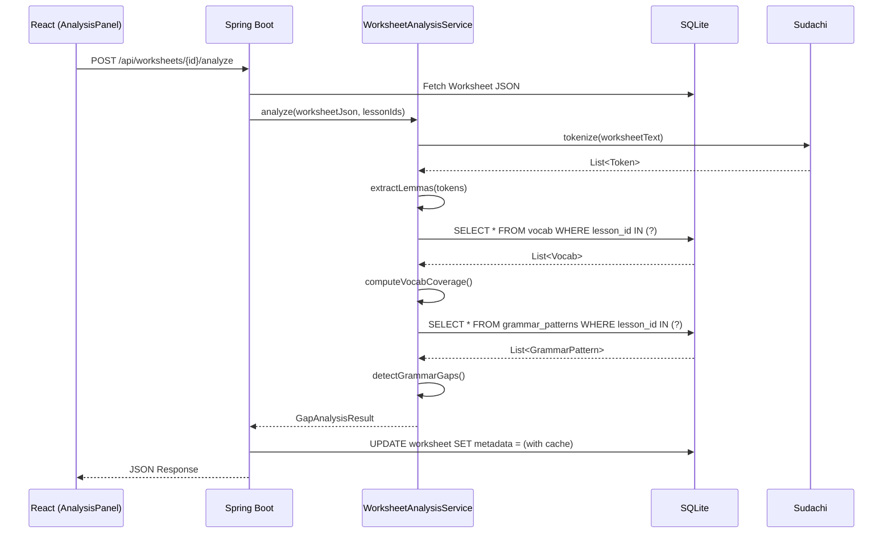

# Gap Analysis Proposal: Technical Review

**Date:** 2025-12-23  
**Status:** UNDER REVIEW  

---

## Executive Summary

The Gap Analysis System proposal is **technically sound** and aligns well with the existing architecture. However, **significant foundational work is required** before implementation can begin.

> [!IMPORTANT]
> **Current State:** No `Vocab` table, no `Grammar_Patterns` table, and no Sudachi dependency exist in the codebase. The proposal requires building these from scratch.

---

## Codebase Compatibility Assessment

### ✅ What Already Exists (Leverage These)

| Component | File | Notes |
|-----------|------|-------|
| Worksheet Entity | `Worksheet.java` | Has `metadata` TEXT field ready for caching analysis results |
| Worksheet Types | `worksheet.ts` | 8 item types defined: `HEADER`, `CARD`, `GRID`, `VOCAB`, `MULTIPLE_CHOICE`, `TRUE_FALSE`, `MATCHING`, `CLOZE` |
| Metadata DTO | `WorksheetMetadataDto.java` | Already tracks `vocabCount`, `gridCount`, etc. |
| Analysis Types | `analysis.ts` | Existing quiz analytics types can be extended |

### ❌ What Does NOT Exist (Must Build)

| Component | Impact | Effort |
|-----------|--------|--------|
| `Vocab` Table | **HIGH** — No vocabulary database to compare against | New Entity + Repository + Data Entry UI |
| `Grammar_Patterns` Table | **HIGH** — No sentence template database | New Entity + Repository + Admin UI |
| Sudachi Integration | **HIGH** — No tokenizer for lemmatization | Add Maven dependency + Configuration |
| Lesson Concept | **MEDIUM** — Worksheets have no `lessonId` association | Schema change or metadata extension |

---

## Answers to Design Questions

### Q1: Tagging Complexity — Multiple Tags per Word?

**Recommendation: YES — Allow multiple tags per word.**

```java
// Example: vocab.getTags() -> "event, place, time-expression"
```

**Rationale:**
- Japanese vocabulary is inherently multi-functional
- "Hanami" (花見) IS both an `event` and can be used as a `place` ("Hanami ni iku" ≈ "Go to the cherry blossom viewing")
- CSV format with `contains()` matching is sufficient

**Implementation:**
```java
// In WorksheetAnalysisService.java
public boolean vocabMatchesTag(Vocab vocab, String requiredTag) {
    return Arrays.stream(vocab.getTags().split(","))
                 .map(String::trim)
                 .anyMatch(tag -> tag.equalsIgnoreCase(requiredTag));
}
```

---

### Q2: Sudachi Configuration — User Dictionary Needed?

**Recommendation: NO USER DICTIONARY INITIALLY — Ignore proper nouns for coverage.**

**Rationale:**
1. **Sudachi's default dictionary** handles standard MNN vocabulary well
2. **Proper nouns (Mirror-san, IMC Company)** are not "coverage targets" — teachers aren't testing if students know character names
3. **Complexity cost** of maintaining a user dictionary is high
4. If proper noun detection becomes critical later, we can add it

**Practical Approach:**
```java
// Filter out proper nouns during analysis
List<String> IGNORED_POS = List.of("固有名詞", "人名", "地名");

tokens.stream()
    .filter(token -> !IGNORED_POS.contains(token.partOfSpeech().get(1)))
    .map(Token::normalizedForm)
    .collect(Collectors.toList());
```

> [!TIP]
> Start with Sudachi's `small` dictionary for faster startup, upgrade to `core` if needed.

---

### Q3: Worksheet Scope — Single Lesson or Multi-Lesson?

**Recommendation: SUPPORT BOTH — Use metadata to store lesson scope.**

**Current Reality:**
- Worksheets don't have a `lessonId` field
- Your `WorksheetMetadata` (line 39 of `Worksheet.java`) is a JSON TEXT field

**Proposed Solution:**
Extend the existing JSON metadata to include lesson scope:

```json
// Worksheet.metadata
{
  "gridCount": 2,
  "vocabCount": 5,
  "lessonScope": {
    "type": "single",       // or "range" or "custom"
    "lessonIds": [5]        // or [1, 2, 3, 4, 5, 6] for midterm
  },
  "analysis_cache": { ... }  // Cached gap analysis results
}
```

**UI Implication:**
Before running analysis, prompt the user:
> "Which lesson(s) does this worksheet cover?"
> - [ ] Lesson 5 only
> - [ ] Lessons 1-5 (Cumulative)
> - [ ] Custom selection

---

### Q4: "Used" Definition — Count Distractors?

**Recommendation: YES — Count everything as "Used".**

**Rationale:**
1. **Exposure is valuable:** Students read ALL options, not just the correct one
2. **Receptive vocabulary** (recognition) comes before productive (writing)
3. **Simplicity:** No need to parse "correctness" from JSON

**Alternative (if you disagree):**
Track two metrics:
- `used_exposure`: All words appearing in any item
- `used_productive`: Only words in correct answers / fill-in targets

For V1, single `used` = exposure is cleaner.

---

## Implementation Prerequisites

Before starting the proposal phases, complete these foundational tasks:

### 0a. Add Sudachi Dependency

```xml
<!-- pom.xml -->
<dependency>
    <groupId>com.worksap.nlp</groupId>
    <artifactId>sudachi</artifactId>
    <version>0.7.3</version>
</dependency>
<dependency>
    <groupId>com.worksap.nlp</groupId>
    <artifactId>sudachi-dictionary</artifactId>
    <version>20240409</version>
    <classifier>small</classifier>
</dependency>
```

### 0b. Create Vocab Entity

```java
@Entity
@Table(name = "vocab")
public class Vocab {
    @Id
    @GeneratedValue(strategy = GenerationType.IDENTITY)
    private Long id;
    
    @Column(nullable = false)
    private Integer lessonId;
    
    @Column(nullable = false)
    private String kanji;      // 学校
    
    private String hiragana;   // がっこう
    
    private String romaji;     // gakkou
    
    @Column(nullable = false)
    private String meaning;    // school
    
    private String tags;       // "place, education"
}
```

### 0c. Create GrammarPattern Entity

```java
@Entity
@Table(name = "grammar_patterns")
public class GrammarPattern {
    @Id
    @GeneratedValue(strategy = GenerationType.IDENTITY)
    private Long id;
    
    @Column(nullable = false)
    private Integer lessonId;
    
    @Column(nullable = false)
    private String label;              // "Motion (Destination)"
    
    @Column(nullable = false)
    private String patternTemplate;    // "{{place}} へ {{verb-motion}}"
    
    @Column(nullable = false)
    private String requiredTags;       // "place, verb-motion"
    
    private String exampleSentence;    // "Kyoto e ikimasu."
}
```

### 0d. Data Entry Strategy

> [!CAUTION]
> **The hardest part of this feature is populating the Vocab and Grammar tables.**

Options:
1. **Manual Entry:** Build an admin UI (time-consuming)
2. **CSV Import:** Prepare Excel → CSV → Bulk insert (faster)
3. **External API:** Call a dictionary API (complex but scalable)

**Recommendation:** Start with CSV Import for Lesson 1-10 as a proof-of-concept.

---

## Architecture Validation



The proposed architecture **fits cleanly** into the existing pattern of:
- React → Spring Boot REST → Service Layer → SQLite

---

## Risk Assessment

| Risk | Likelihood | Mitigation |
|------|------------|------------|
| Sudachi startup slow (~3s) | HIGH | Lazy initialization, cache tokenizer |
| Vocab data entry tedious | HIGH | Prioritize CSV import + focus on 1-10 first |
| Grammar patterns too rigid | MEDIUM | Keep `pattern_template` human-readable, not regex |
| Analysis too slow | LOW | Cache in metadata, run async |

---

## Next Steps

If you approve this review, I recommend the following order:

1. **Phase 0:** Add Sudachi dependency, create `Vocab` and `GrammarPattern` entities
2. **Data Entry:** Create CSV import for Lesson 1-5 vocabulary
3. **Phase 2:** Build `WorksheetAnalysisService` with token extraction
4. **Phase 3:** Create API endpoint + caching logic
5. **Phase 4:** Build React `AnalysisPanel` component

---

## Questions for You

Before proceeding, please confirm:

1. **Scope:** Should I start with Lessons 1-5, or 1-10?
2. **Data Source:** Do you have existing vocabulary lists (Excel/CSV), or should I source from textbook?
3. **Priority:** Focus on vocab coverage first, grammar gaps later?
