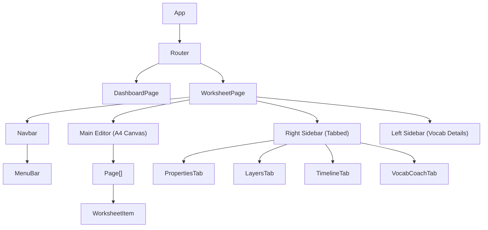

# Technical Architecture: Phase 2 UI Restructure & Dashboard

**Date:** 2025-05-27
**Status:** DRAFT (Architecture Validated)
**Author:** Jules (Tech Lead)

---

## 1. Executive Summary

This architecture document outlines the technical strategy for implementing **Phase 2: UI Restructure** and the **Worksheet Dashboard** system. The goal is to transition the application from a linear editor to a robust, Google Docs-style platform that supports advanced editing workflows (Menu Bar, Context Menus) and enterprise-grade file management (Autosave, Snapshots, Templates).

The "Page Break Logic" constraint identified in the requirements has been analyzed. The current frontend implementation (`WorksheetPage.tsx`) already supports multi-page rendering for print (`pages.map...` in a print-only container) and the backend data model persists the full `pages` structure within `jsonContent`. Therefore, the foundation for page handling is solid, and we can proceed with the Dashboard and UI restructuring.

---

## 2. Design Analysis & Technical Feasibility

### 2.1 UI Restructure (Phase 2)
The shift from a "Toolbar + Sidebar" to a "Menu Bar + Context Menu + Tabbed Sidebar" is technically feasible and aligns with standard desktop-class web application patterns (e.g., Google Docs, VS Code).
- **Complexity:** Medium-High. Requires significant refactoring of `WorksheetPage.tsx` and state lifting.
- **Performance:** Low risk. React's virtual DOM handles the UI state changes efficiently. The main performance consideration is the "live preview" of history items, which should use lightweight JSON parsing or thumbnails (future scope).
- **Accessibility:** High priority. The new Menu Bar and Context Menus must support keyboard navigation (Arrow keys, Enter, Escape) and ARIA attributes.

### 2.2 Dashboard & Persistence
The Dashboard introduces a file system metaphor (Folders/Autosaves).
- **Complexity:** Medium. Backend CRUD is standard. Frontend state management for "Files" vs "Editor" needs clear separation.
- **Scalability:** The `jsonContent` field is a TEXT blob. As worksheets grow (images, many pages), this could become a bottleneck.
  - *Mitigation:* The `Worksheet` entity already uses a `WorksheetSummary` projection (implied requirement) or should use one to fetch lists without loading the full JSON blob.
  - *Autosave:* Capped at 10 per parent to prevent DB bloat.

---

## 3. System Architecture Design

### 3.1 Component Architecture (Frontend)

**Key Architectural Decisions:**
1.  **State Management:** Continue using `useWorksheet` hook as the central store for editor state. `useAutoSave` hooks into this state to trigger background saves.
2.  **Navigation:** `react-router-dom` (or hash router equivalent) manages transitions. `/#worksheet/dashboard` is the entry point.
3.  **Isolation:** The `Print` view is isolated in the DOM (`print:block` vs `print:hidden`) to ensure WYSIWYG accuracy without polluting the editor UI.

### 3.2 Data Flow
1.  **Load:** `Dashboard` -> `GET /api/worksheets/{id}` -> `WorksheetPage` (initializes state).
2.  **Edit:** User interaction -> `useWorksheet` updates local state.
3.  **Autosave:** `useAutoSave` (debounce/interval) -> `POST /api/worksheets/{id}/autosave`.
4.  **Snapshot:** Menu Bar "Save Snapshot" -> `POST /api/worksheets/{id}/snapshot`.

---

## 4. Database Architecture

The backend schema changes described in `WORKSHEET_DASHBOARD_PLAN.md` are **ALREADY IMPLEMENTED** in the codebase (`Worksheet.java`, `WorksheetType.java`).

**Schema:**
- `Worksheet` table:
  - `id`: PK
  - `type`: Enum (SNAPSHOT, AUTOSAVE, TEMPLATE)
  - `parentId`: Self-reference FK (nullable)
  - `metadata`: JSON (counts, etc.)
  - `jsonContent`: TEXT (full data)

**Optimization Strategy:**
- List endpoints MUST use JPA Projections (`WorksheetSummary`) to exclude `jsonContent` to ensure fast dashboard loading.

---

## 5. Implementation Plan (Handoff)

### Phase 2.1: Foundation & Clean Up (Immediate)
- **Status:** **DONE**. Critical print bugs and margin issues fixed. Backend entity updated.

### Phase 2.2: Frontend UI Components (Next Step)
1.  **`MenuBar.tsx`**: Implement dropdown primitives.
2.  **`Sidebar.tsx`**: Refactor to support Tabs (Properties, Layers, Timeline, Coach).
3.  **`VocabCoachPanel.tsx`**: Create the visual component for vocab stats.

### Phase 2.3: Layout Refactor
1.  **`WorksheetPage.tsx`**:
    - Remove old Toolbar buttons.
    - Integrate `MenuBar`.
    - Move `TimelineSidebar` into the Right Sidebar tab.
    - Implement Context Menu logic (Right-click on A4 vs Background).

### Phase 2.4: Dashboard & Integration
1.  **`WorksheetDashboardPage.tsx`**: Implement the file browser.
2.  **`WorksheetStorageController`**: Ensure endpoints match the frontend expectations.

---

## 6. Development Guidelines

- **Styling:** Tailwind CSS only. No inline styles except dynamic values (zoom).
- **Icons:** Lucide-React or Heroicons (consistent set).
- **Testing:**
  - *Unit:* Vitest for logic hooks (`useAutoSave`).
  - *E2E:* Playwright for the "Create -> Autosave -> Resume" flow.
- **Code Quality:** STRICT adherence to "1 Component = 1 Responsibility". Do not dump everything into `WorksheetPage`.

---

## 7. Risk Register

| Risk | Impact | Mitigation |
|------|--------|------------|
| **Mobile Viewport** | The new Menu Bar might overflow on small screens. | Accept as "Desktop First". Hide non-essential menus on mobile. |
| **Save Conflict** | Two tabs open on same worksheet. | Last write wins (currently). Future: Optimistic locking with version #. |
| **Performance** | Large `jsonContent` slowing down `GET /api/worksheets`. | **Strict enforcement of Projections for list views.** |

---

*Approved by: Jules (Tech Lead)*
