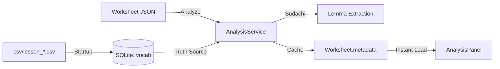

# Implementation Plan: Vocabulary Gap Analysis (Phase 1)

**Created:** 2025-12-23  
**Status:** AWAITING APPROVAL  

---

## Overview

Transform the worksheet editor into a "Coach" that analyzes vocabulary coverage against Minna no Nihongo lesson vocabulary lists stored in CSV files.



---

## User Review Required

> [!IMPORTANT]
> **Design Decisions Requiring Confirmation:**

| Question | Proposed Answer | Rationale |
|----------|-----------------|-----------|
| **Q1. Homonym Handling** | Kanji-based matching for Phase 1 | CSV has `学生` not `がくせい` — exact match is cleaner |
| **Q2. Wipe Policy** | YES — Delete + Reload on startup | Development speed; tags come in Phase 2 |
| **Q3. Analysis Trigger** | Manual button only | Avoid slowing down saves |
| **Q4. Distractor Handling** | Count ALL text as "Used" | Exposure = recognition practice |

---

## Proposed Changes

### Phase 0: Prerequisites

---

#### [MODIFY] pom.xml

Add Sudachi dependencies for Japanese NLP:

```xml
<!-- Sudachi Japanese Tokenizer -->
<dependency>
    <groupId>com.worksap.nlp</groupId>
    <artifactId>sudachi</artifactId>
    <version>0.7.3</version>
</dependency>
<dependency>
    <groupId>com.worksap.nlp</groupId>
    <artifactId>sudachi-dictionary</artifactId>
    <version>20240409</version>
    <classifier>small</classifier>
</dependency>
```

---

#### [NEW] entity/Vocab.java

JPA Entity for vocabulary storage:

```java
@Entity
@Table(name = "vocab")
public class Vocab {
    @Id
    @GeneratedValue(strategy = GenerationType.IDENTITY)
    private Long id;
    
    @Column(nullable = false)
    private Integer lessonId;           // e.g., 1, 2, 3
    
    @Column(nullable = false)
    private String displayForm;         // Original: "学生" or "がくせい"
    
    @Column(nullable = false)
    private String baseForm;            // Sudachi normalized: "学生"
    
    // Getters, setters, constructors
}
```

**Key Design:**
- `displayForm`: What appears in CSV (as-is)
- `baseForm`: Sudachi's dictionary form (normalized at import time)

---

#### [NEW] repository/VocabRepository.java

```java
@Repository
public interface VocabRepository extends JpaRepository<Vocab, Long> {
    List<Vocab> findByLessonId(Integer lessonId);
    List<Vocab> findByLessonIdIn(List<Integer> lessonIds);
    void deleteByLessonId(Integer lessonId);
}
```

---

### Phase 1: Data Ingestion (The "Seeder")

---

#### [NEW] service/VocabSeederService.java

Startup service that loads CSV files into SQLite:

```java
@Service
public class VocabSeederService implements CommandLineRunner {
    
    private static final String CSV_DIRECTORY = "csv";
    private static final Pattern LESSON_PATTERN = Pattern.compile("lesson_(\\d+)\\.csv");
    
    private final VocabRepository vocabRepository;
    private final SudachiTokenizerService tokenizerService;
    
    @Override
    @Transactional
    public void run(String... args) {
        log.info("Starting vocabulary CSV seeder...");
        
        // 1. Scan csv/ directory for lesson_*.csv files
        // 2. For each file:
        //    a. Extract lesson ID from filename
        //    b. Delete existing vocab for this lesson (WIPE policy)
        //    c. Read single-column CSV
        //    d. For each word:
        //       - Normalize to base form using Sudachi
        //       - Insert into vocab table
        // 3. Log summary: "Loaded X words for Lesson Y"
    }
}
```

**Behavior:**
1. Runs on every app startup
2. Scans `csv/` directory for `lesson_*.csv` files
3. Deletes and reloads vocab for each lesson found
4. Stores both `displayForm` (original) and `baseForm` (normalized)

---

#### [NEW] service/SudachiTokenizerService.java

Wrapper around Sudachi for reusability:

```java
@Service
public class SudachiTokenizerService {
    
    private Dictionary dictionary;
    private Tokenizer tokenizer;
    
    @PostConstruct
    public void init() {
        // Load Sudachi dictionary (small mode for speed)
        // Initialize tokenizer once (expensive operation)
    }
    
    /**
     * Returns the dictionary form (lemma) of the input text.
     * For single words: "学生" -> "学生"
     * For sentences: "学校へ行きます" -> ["学校", "へ", "行く"]
     */
    public List<String> tokenize(String text) {
        // Returns list of base forms (dictionary forms)
        // Filters out particles, punctuation
    }
    
    /**
     * Normalize a single word to its base form.
     * "行きます" -> "行く"
     */
    public String normalizeWord(String word) {
        List<String> tokens = tokenize(word);
        return tokens.isEmpty() ? word : tokens.get(0);
    }
}
```

---

### Phase 2: Analysis Logic (The "Brain")

---

#### [NEW] service/WorksheetAnalysisService.java

Core analysis engine:

```java
@Service
public class WorksheetAnalysisService {
    
    private final VocabRepository vocabRepository;
    private final SudachiTokenizerService tokenizerService;
    private final ObjectMapper objectMapper;
    
    /**
     * Analyze worksheet content against target lesson vocabulary.
     * 
     * @param worksheetJson The full worksheet JSON content
     * @param lessonIds List of lesson IDs to check against (e.g., [1] or [1,2,3])
     * @return Analysis result with coverage stats and missing words
     */
    public VocabAnalysisResult analyze(String worksheetJson, List<Integer> lessonIds) {
        // STEP A: Load truth source from DB
        List<Vocab> truthVocab = vocabRepository.findByLessonIdIn(lessonIds);
        Set<String> truthBaseForms = truthVocab.stream()
            .map(Vocab::getBaseForm)
            .collect(Collectors.toSet());
        
        // STEP B: Extract all text from worksheet JSON
        String allText = extractTextFromWorksheet(worksheetJson);
        
        // STEP C: Tokenize and normalize
        List<String> inputBaseForms = tokenizerService.tokenize(allText);
        Set<String> uniqueInputForms = new HashSet<>(inputBaseForms);
        
        // STEP D: Compare
        Set<String> used = new HashSet<>(truthBaseForms);
        used.retainAll(uniqueInputForms);  // Intersection
        
        Set<String> missing = new HashSet<>(truthBaseForms);
        missing.removeAll(uniqueInputForms);  // Difference
        
        // STEP E: Build result
        int coveragePercent = (used.size() * 100) / truthBaseForms.size();
        
        return new VocabAnalysisResult(
            coveragePercent,
            truthVocab.size(),
            used.size(),
            buildMissingList(missing, truthVocab)
        );
    }
    
    /**
     * Extract all analyzable text from worksheet JSON.
     * Traverses pages[].items[] and extracts text based on item type.
     */
    private String extractTextFromWorksheet(String worksheetJson) {
        // Parse JSON
        // For each item type, extract relevant text:
        // - MULTIPLE_CHOICE: prompt + all options
        // - TRUE_FALSE: prompt + questions[].text
        // - MATCHING: prompt + pairs[].left + pairs[].right
        // - CLOZE: template + answers[]
        // - VOCAB: terms[].term + terms[].meaning
        // - GRID: description + sections[].boxes[].char
        // - HEADER: title
        // - CARD: content
        // Concatenate all into single string
    }
}
```

---

#### [NEW] dto/VocabAnalysisResult.java

DTO for analysis response:

```java
public record VocabAnalysisResult(
    int coveragePercent,          // 0-100
    int totalVocabCount,          // Total words in lesson
    int usedCount,                // Words found in worksheet
    List<MissingWord> missingWords  // Words not found
) {}

public record MissingWord(
    String displayForm,           // Original form from CSV
    String baseForm               // Normalized form
) {}
```

---

### Phase 3: API Integration

---

#### [MODIFY] controller/WorksheetStorageController.java

Add new analysis endpoint:

```java
/**
 * Analyze worksheet vocabulary coverage.
 * POST /api/worksheets/{id}/analyze
 * 
 * Request body: { "lessonIds": [1, 2, 3] }
 * Response: VocabAnalysisResult JSON
 */
@PostMapping("/{id}/analyze")
public ResponseEntity<VocabAnalysisResult> analyzeWorksheet(
        @PathVariable Long id,
        @RequestBody AnalyzeRequest request) {
    
    return worksheetRepository.findById(id)
        .map(worksheet -> {
            // Run analysis
            VocabAnalysisResult result = analysisService.analyze(
                worksheet.getJsonContent(),
                request.lessonIds()
            );
            
            // Cache result in metadata
            worksheet.setMetadata(cacheAnalysisResult(worksheet.getMetadata(), result));
            worksheetRepository.save(worksheet);
            
            return ResponseEntity.ok(result);
        })
        .orElse(ResponseEntity.notFound().build());
}

public record AnalyzeRequest(List<Integer> lessonIds) {}
```

---

### Phase 4: Frontend (Future)

> [!NOTE]
> Frontend implementation is deferred to a separate task. This plan focuses on backend only.

**Planned Components:**
- `AnalysisPanel.tsx` — Sidebar component showing coverage stats
- `useAnalysis.ts` hook — API integration
- Integration with worksheet editor's save flow

---

## File Summary

| Phase | Action | File |
|-------|--------|------|
| 0 | MODIFY | `pom.xml` |
| 0 | NEW | `entity/Vocab.java` |
| 0 | NEW | `repository/VocabRepository.java` |
| 1 | NEW | `service/VocabSeederService.java` |
| 1 | NEW | `service/SudachiTokenizerService.java` |
| 2 | NEW | `service/WorksheetAnalysisService.java` |
| 2 | NEW | `dto/VocabAnalysisResult.java` |
| 3 | MODIFY | `controller/WorksheetStorageController.java` |

---

## Verification Plan

### Automated Tests

```bash
# 1. Build with new dependencies
mvn clean compile

# 2. Start app and verify seeder runs
mvn spring-boot:run
# Expected log: "Loaded 42 words for Lesson 1"

# 3. Test analysis endpoint
curl -X POST http://localhost:8080/api/worksheets/1/analyze \
  -H "Content-Type: application/json" \
  -d '{"lessonIds": [1]}'
# Expected: JSON with coveragePercent, usedCount, missingWords
```

### Manual Verification

1. Add a new CSV file `csv/lesson_2.csv` and restart — should auto-load
2. Create a worksheet with known vocabulary and analyze — verify correct coverage %
3. Check `Worksheet.metadata` column contains cached analysis result

---

## Dependencies

```
csv/lesson_1.csv (EXISTS - 42 items)
├── Sudachi (NEW - Maven dependency)
├── entity/Vocab.java (NEW)
├── repository/VocabRepository.java (NEW)
├── service/SudachiTokenizerService.java (NEW)
├── service/VocabSeederService.java (NEW)
├── service/WorksheetAnalysisService.java (NEW)
└── controller/WorksheetStorageController.java (MODIFY)
```

---

## Questions Resolved

| Original Question | Resolution |
|-------------------|------------|
| Q1. Homonym ("Hashi") | **Kanji matching** — CSV already has Kanji forms, no Kana conversion needed for Phase 1 |
| Q2. Wipe Policy | **YES** — Delete all vocab for lesson on startup, reload from CSV |
| Q3. Scope of Analysis | **Manual trigger** — POST `/api/worksheets/{id}/analyze` button |
| Q4. Distractor Handling | **Count ALL** — Every text item contributes to coverage |

---

## Next Steps

After approval:
1. Add Sudachi dependencies to `pom.xml`
2. Create `Vocab` entity and repository
3. Implement `SudachiTokenizerService` (with init logging)
4. Implement `VocabSeederService` (startup CSV loader)
5. Implement `WorksheetAnalysisService` (the brain)
6. Add `/analyze` endpoint
7. Test end-to-end

**Estimated Effort:** 4-6 hours for backend only
